# ROCKNIX Command Center (rp5deck) — User Guide

**Status:** community project, tested on one Retroid Pocket 5; experimental parts are marked where they apply. This guide is for version 1.6.0. The project used to be called the Dual Screen Command Center.

## 1. What it is

The Command Center is a touch-only companion app that runs on the **Retroid
Pocket 5's own built-in screen** (the bottom screen when the device is docked
in the Retroid Dual Screen Add-on). Its on-screen name is
"**\<your device name\> Command Center**" (the device name is read at
startup, so on a Retroid Pocket 5 it reads "Retroid Pocket 5 Command
Center"); the app itself is called `rp5deck`.

It gives you, on the bottom screen:

- Volume control (master and per-app) that doesn't need the top screen.
- A device-info (HUD) panel: battery, CPU/GPU, temperatures, fan, RAM,
  storage, Wi-Fi, uptime.
- A web browser, a YouTube app, and Discord's web app.
- Steam: while Steam is open, a library of your installed games as cover art, the running game's details on
  the Companion, and stop controls in Clean state.
- A manual viewer, a hotkey cheat sheet, stick-light controls, an on-screen
  keyboard toggle, a "Clean state" recovery button, a Sleep button, a
  battery charge limiter, and a screen-swap toggle.
- A "Companion" view (in the style of the ES-DE Companion app) that shows the
  selected game's art or video while you browse your library, and switches
  to a manual or a light overlay while a game is running.

**The gamepad always stays a game control.** The Command Center is
touch-driven for everything inside it, and never grabs input away from
whatever has it. The one exception is the single hardware "summon" button
(Back, by default — see
[Opening and closing the Command Center](#5-opening-and-closing-the-command-center))
that opens and closes the Command Center: it only watches for that one
press, it never intercepts it, so the same press still reaches the game or
EmulationStation too. It never reads the D-pad, analog sticks, or any other
button. Whatever game or menu has them, keeps them.

### Requirements

- A Retroid Pocket 5 running ROCKNIX.
- The **Retroid Dual Screen Add-on**, attached and in its normal display
  mode (not "charge only" mode), for full functionality. With it attached:
  the add-on's screen ("top") shows EmulationStation and your games, and the
  RP5's own screen ("bottom") shows the Command Center.
- A separate background service (`dual-screen-layout-and-power`, not part of
  rp5deck itself — see [Installing](#2-installing-updating-removing)) that
  keeps this two-screen layout working across reboots. rp5deck depends on
  it; it does not replace it.

### Without the add-on ("undocked")

If the add-on isn't attached, EmulationStation and your games use the RP5's
own screen full-screen, the same as on a Retroid Pocket 5 without this
project at all. The Command Center stops drawing anything until the add-on
is reconnected - unless **Single-screen mode** is on (see
[Single-screen mode](#single-screen-mode)), which also runs the Browser,
Discord, the YouTube App and Steam on that one screen. The hardware volume
buttons keep working either way.

### Other ROCKNIX devices (untested)

The Command Center is built and tested on the **Retroid Pocket 5 only**. The
devices below run ROCKNIX and have the screens it needs, so it should work
on them, but **none of them has been tested**. Screen sizes come from
ROCKNIX's own device files and wiki; "unknown" means they were not found.

| Device | Chip | Screens | Panel | Status |
|---|---|---|---|---|
| Retroid Pocket 5 (+ Dual Screen add-on) | SM8250 | 1, or 2 with the add-on | 1920x1080 | **Tested** |
| Retroid Pocket Flip 2 (+ add-on) | SM8250 | 1, or 2 with the add-on | 1920x1080 class | Untested |
| Retroid Pocket Mini / Mini V2 (+ add-on) | SM8250 | 1, or 2 with the add-on | unknown (4:3) | Untested |
| AYN Thor / Thor Lite | SM8550 / SM8250 | 2 built in | unknown | Untested |
| AYANEO Pocket DS | SM8550 | 2 built in | unknown | Untested |
| Anbernic RG DS | RK3566 | 2 built in | 640x480 each | Untested |
| Anbernic RG DS Plus | RK3566 | 2 built in | 1024x768 each | Untested |
| Powkiddy X55 | RK3566 | 1 | 1280x720 | Untested (single-screen mode) |
| Anbernic RG353P/M/V/VS, RG ARC-D/S | RK3566 | 1 | 640x480 | Untested (single-screen mode) |
| Anbernic RG CubeXX | H700 | 1 | 720x720 | Untested (single-screen mode) |
| Other ROCKNIX handhelds with a touch screen (Retroid Pocket 6 / Classic / Nova, AYN Odin 2 / Odin 3, AYANEO Pocket models, RG552, RG Vita Pro, GameForce ACE, ...) | various | 1 | unknown | Untested (single-screen mode) |

Two things decide whether it works on a device: a **touch screen** (the
Command Center is driven by touch - the gamepad stays the game's) and, for
the two-screen layout, **two screens**. On one screen it runs in
single-screen mode. Set **Settings > Screens > Screen size preset** if its
buttons come out too big or too small.

## 2. Installing, updating, removing

**Honestly: there is currently no polished, one-click installer.** Installing
rp5deck today means copying files onto the device and running a couple of
scripts from a command line (for example over SSH). This section describes
the actual mechanism in the code, so a technically comfortable ROCKNIX user
can follow it; a friendlier packaged installer is future work.

### Prerequisites

Enable SSH on the device (START > Network Settings > Enable SSH; the IP
address is shown at the top of that menu) and log in as `root`. The paths
below refer to this project's repository: `app/` is the Command Center and
`scripts/` holds the two system scripts. The rp5deck verify and install
scripts (steps 3 and 4) refuse to run unless they detect a Retroid Pocket 5
with the add-on attached and showing a picture (set `TD_ALLOW_UNDOCKED=1` to
run them without the add-on). The hooks installer and
`scripts/install.sh` (steps 6 and 7) have no such check, so run them only
on that hardware.

### Installing or updating

1. Copy `app/` to a new folder on the device, for example
   `/storage/rp5deck-new/rp5deck`. It must not be `/storage/rp5deck`, the
   installed copy.
2. On the device, in that folder, write the checksum list the verify script
   checks every file against:

   ```bash
   find . -type f ! -name MANIFEST.md5 ! -path '*/__pycache__/*' -print0 | xargs -0 md5sum > MANIFEST.md5
   ```

3. Check the copy: `sh testday/td1-verify-build.sh`. It compares every file
   with the list, checks that every Python and shell file parses, and ends
   with `RESULT: build verified`.
4. Install it: `sh testday/td3-install.sh install`. This:
   - backs up the current install (the app folder and the
     `/storage/.config/autostart/command-center-app` autostart entry) to a
     timestamped folder under `/storage/rp5deck-backups/`;
   - copies the new files to `/storage/rp5deck`, the app's running
     location;
   - **keeps your existing settings file (`config.json`)**, so updating
     doesn't reset your settings;
   - installs the autostart entry and starts the app.
5. Switch the focus guard (which returns controller focus to
   EmulationStation after a game closes, see
   [Known limitations](#12-known-limitations-and-troubleshooting)) from its
   first-install observe-only mode to normal:
   `sh /storage/rp5deck/testday/td3-install.sh guard-live`.
6. Install the EmulationStation event hooks, the small scripts that tell the
   Companion view which game is selected:
   `sh /storage/rp5deck/tools/install-es-hooks.sh`. It refuses to install if
   a game or file name contains characters that are unsafe to pass to a
   shell (quotes, `$`, backticks and similar), and lists them instead; rename
   those entries, or add `--force` if you accept the risk. Then restart
   EmulationStation with `systemctl restart essway` (never `sway.service`),
   because it only reads its hooks at startup.
7. Copy `scripts/` to the device and run `sh install.sh` in it once. It
   installs `dual-screen-layout-and-power` to `/storage/.config/autostart/` (the
   layout daemon that keeps both screens set up across reboots and moves each
   dual-screen emulator's second window to the right screen, see
   [Dual-screen emulators](#9-dual-screen-emulators); it starts at the next
   boot) and the `dp-sleep-guard` suspend helper
   (`/storage/.config/dp-sleep-guard.sh` and
   `/storage/.config/system.d/dp-sleep-guard.service`, enabled). The sleep
   guard runs before **every** suspend, not only the Sleep tile's, and keeps
   the add-on's screen from resetting the device (see [Sleep](#sleep)). The
   daemon also puts a web app's window on its own workspace and
   EmulationStation back on its own when you are on a single screen, so
   update it together with the app when you update.
8. Optional, for Steam: `sh /storage/rp5deck/steam/install-steam-nested.sh install`
   (it comes with `app/`), then `systemctl restart essway`. It runs Steam
   inside the desktop so the Command Center stays up (see
   `app/steam/INSTALL.md`). Steam has to be set up on ROCKNIX already, and
   `/storage/.local/share/Steam` has to be a real folder, the script warns if
   it isn't. `sh install-steam-nested.sh remove` puts ROCKNIX's own launch
   back, `status` shows where it stands.

From a PC with Python 3 and `paramiko`, `scripts/deploy_rp5deck.py <name> --install`
(add `--undocked` when the add-on isn't attached)
does steps 1 to 5 over SSH, reading the connection details from environment
variables or a local `rk_local.json` (see `scripts/rk.py`).

Updating rp5deck later is the same **install** action — it always backs up
first and keeps your settings.

### Removing

- Roll back rp5deck itself: the install script's **rollback** action stops
  the app, removes its autostart entry, and restores whichever backup you
  point it at.
- Remove the EmulationStation hooks with the hooks installer's **remove**
  option (deletes all the hook scripts it installed), then restart
  EmulationStation (`systemctl restart essway`).
- rp5deck pins one of ROCKNIX's own boot-time settings
  (`DEVICE_HAS_DUAL_SCREEN`) to "off" every time it starts, because leaving
  it on causes problems described in
  [Dual-screen emulators](#9-dual-screen-emulators). Removing rp5deck does
  **not** undo this pin by itself — see the kill-switch table below if you
  want that behaviour back without rp5deck.
- Nested Steam comes out with `sh /storage/rp5deck/steam/install-steam-nested.sh remove`
  (it removes its two files and puts ROCKNIX's own Steam launch back).
- There is no separate "remove" script for the `dual-screen-layout-and-power`
  daemon yet; removing it means deleting its autostart file, or simply
  using its kill switch below.
- There is likewise no uninstaller for the `dp-sleep-guard` suspend helper;
  remove it by hand with `systemctl disable dp-sleep-guard.service`, then
  delete `/storage/.config/dp-sleep-guard.sh` and
  `/storage/.config/system.d/dp-sleep-guard.service`.

### Kill switches

Every part of this can be turned off without uninstalling anything, by
creating an empty file at the given path (delete the file to turn it back
on):

| File | Effect |
|---|---|
| `/storage/.disable-rp5deck` | Stops the whole Command Center app, its focus guard, and its game-screen pull tab. |
| `/storage/.disable-rp5deck-focus-guard` | Stops only the focus guard; the Command Center itself keeps running. |
| `/storage/.disable-rp5deck-overlay` | Stops only the small Command Center pull tab that can appear on the game/EmulationStation screen. |
| `/storage/.disable-dualscreen` | Stops the `dual-screen-layout-and-power` daemon entirely, reverting to ROCKNIX's stock (non-persistent) dual-screen behaviour. |
| `/storage/.rp5deck-keep-dual-flag` | Stops rp5deck from pinning ROCKNIX's `DEVICE_HAS_DUAL_SCREEN` setting to "off" at every start. |

## 3. First launch and the screen layout

| Term used here | Physical screen | What lives there (docked) |
|---|---|---|
| **Top** | The Retroid Dual Screen Add-on | EmulationStation and your games |
| **Bottom** | The RP5's own built-in screen | The Command Center |

The bottom screen shows the **Companion view** by default — the selected
game's cover art or preview video, matching whatever you're browsing on the
top screen. Swipe down from the top edge of the bottom screen, or press the
hardware summon button (Back, by default), to pull the Command Center down
over it. See [Opening and closing the Command Center](#5-opening-and-closing-the-command-center).

A **Swap screens** setting/tile can put EmulationStation and your games on
the RP5's own screen instead, with the Command Center on the add-on's
screen — see [Screen swap](#screen-swap).

## 4. Touch basics

The Command Center is built for fingers: every button and slider is sized
for a touch (about 8 mm, comfortably bigger than the tap targets on most
phone UIs). There is no cursor and no gamepad navigation inside the Command
Center — everything is tap, drag, or swipe.

## 5. Opening and closing the Command Center

| Action | How |
|---|---|
| Open from the Companion view | Swipe down from the top edge of the bottom screen, **or** press the summon button (**Back**, by default). |
| Close | Swipe up (steps down one level at a time: Settings → Command Center → Companion), or press the summon button again (closes all the way back to the Companion view in one press, even from Settings). |
| Auto-close | Optional: close automatically after a set number of seconds of no touch (off by default). |

Settings that control this (Command Center group):

| Setting | Default | Notes |
|---|---|---|
| Swipe down to open | On | Turn off to require the hardware button only. |
| Swipe sensitivity | Medium | **Low**: you must start very close to the top edge and swipe further before it opens — least likely to trigger by accident. **High**: a shorter swipe starting anywhere in a wider strip near the top opens it — easiest to trigger, but more prone to accidental opens. **Medium** is in between. |
| Hardware button | Back | The physical button (in addition to swiping) that opens/closes the Command Center. Two "paddle button" options also appear in this list for other handhelds — the Retroid Pocket 5 has no working rear paddles, so those options currently do nothing on this device. |
| Auto-close timeout | Off (0 seconds) | 0 means never auto-close. Up to 120 seconds. |

## 6. The home screen

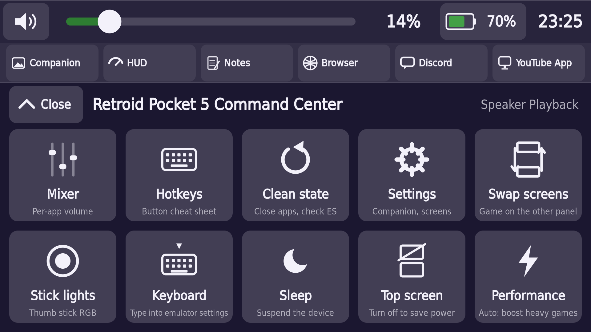

Once open, the Command Center's home screen is a grid of tiles:

| Tile | What it does |
|---|---|
| **Mixer** | Per-app volume sliders and mute — see [Volume and the Mixer](#volume-and-the-mixer). |
| **Hotkeys** | A cheat sheet of button combos — see [Hotkeys](#hotkeys). |
| **Clean state** | Close apps, check EmulationStation — see [Clean state](#clean-state). |
| **Settings** | Companion, screens, and every other setting in this guide. |
| **Swap screens** | Puts the game on the other panel — see [Screen swap](#screen-swap). |
| **Stick lights** | Thumb-stick RGB colour — see [Stick lights](#stick-lights-rgb). |
| **Keyboard** | Type into emulator settings — see [On-screen keyboard](#on-screen-keyboard-toggle). |
| **Power** | Sleep, Restart, Shut down (and Hibernate, once it works) — see [Power](#power). |
| **Top screen** | Turns the add-on's screen *and its power* off to save battery — see [Top screen off](#top-screen-off). |
| **Performance** | Auto / Max / Saver: how hard the CPU and GPU may run — see [Performance](#performance). |

**HUD, Notes, Browser, Discord and YouTube App** are in the **tab strip** just
above the tiles (they used to be tiles as well; the duplicates were removed).
Over a running game, where there is no tab strip, the HUD tile still appears.

A volume strip (mute, slider, level, battery, clock) always sits above the
tiles, because — per the person who designed this — volume should always be
one gesture away.

### Rearranging or hiding tiles

Long-press any tile (about half a second) to enter **Edit tiles** mode: drag
tiles to reorder them, and tap the eye badge in a tile's corner to hide or
show it. Tap **Done** to save, or **Reset tile layout** to put everything
back to the order shown above with nothing hidden. The **Settings** tile can
never be hidden, so you can't lock yourself out of your own settings.
**Settings › Command Center › Edit buttons…** opens the same mode without the
long-press. When a new version adds or removes tiles, your arrangement is kept:
new tiles are added at the end.

## 7. The Companion view

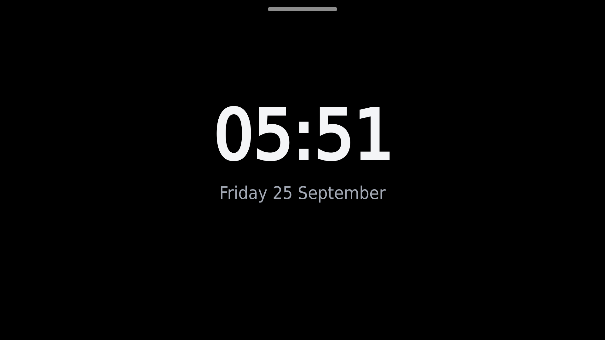

This is what the bottom screen shows by default, styled after the ES-DE
Companion phone app.

**While browsing your library:** the selected game's cover art, screenshot,
title screen, or a short preview video (your choice of priority order, and
which of these appear at all), plus a **Manual** button if that game has a
scanned manual on file.

**While a game is running:** video is never shown — this is a fixed rule to
save CPU for the game, not a setting you can change. Instead, a separate
"what to show while playing" choice picks between: normal art, art with a
darker overlay, a plain black screen, the game's manual (falls back to art
if there isn't one), a small live device-stats strip, a clock, or a
slideshow of that game's own system's artwork.

**While idle** (nothing selected): a clock, a slideshow of your library's
artwork, or a plain black screen.

### Companion settings

| Setting | Default | Notes |
|---|---|---|
| Preferred media order | Video, title screen, mix, image, marquee, fan art, cartridge, box back | Reorder or remove entries from this list to change what's shown and in what priority. |
| Play video | On | |
| Video audio | Follow EmulationStation's mute state | Or always muted / always unmuted. |
| Video start delay | 500 ms | How long you must hold still on a game before its video starts. |
| Loop video | On | |
| Image fit | Fit (whole image visible, letterboxed if needed) | Or Fill (stretched to cover, may distort) / Crop (fills the screen, edges trimmed). |
| Background dim | 15% | A black overlay behind the art/video so any text stays readable. There is no separate blur effect. |
| Show title / year / developer / players | On | Individually switchable. |
| Show rating / description | Off | Individually switchable. |
| Show playtime | Off | |
| During a game, show | Art | Art / dimmed art / off / manual / device-stats overlay / clock / slideshow. |
| Idle behaviour | Clock | Or a slideshow of library art (falls back to the clock if there's no art yet), or a plain black screen. |
| Idle slideshow interval | 10 seconds | |
| Bottom-screen brightness | 80% | **Stored in the settings file but has no on-screen control yet** — see the note at the end of [Settings, in full](#settings-in-full). |
| System background colour | Sample the top screen | While browsing by system (not a specific game), the backdrop behind the system's logo either samples an actual screenshot of the top screen ("Sample", the default — accurate, but skipped entirely during gameplay and only refreshed when you stop scrolling) or reads a colour from your EmulationStation theme's own file ("Theme" — instant, but can't see a per-system background *image* some themes use instead of a flat colour, or which colour variant you picked in EmulationStation). "Off" is always plain black. |

### Manuals

A game's scanned manual (served by EmulationStation the same way box art
is) opens with the **Manual** button, or automatically when the game starts
if you set "Open manual" to that. Pages render **natively on the device**
(not through the browser) and are shown as a two-page spread, like an open
book, which uses far more of the screen than one page alone. Prev/Next turn
two pages at a time, and the next spread is pre-rendered in the background
so turning feels instant. This was verified on the device with a real
multi-page manual; page loads took about half a second the first time and
were instant from cache afterwards.

Tools along the bottom of the viewer:

| Tool | What it does |
|---|---|
| **1 page / 2 pages** | One page at a time (bigger; best for landscape scans) or the two-page spread |
| **Zoom − / Zoom +** | 100%, 150%, 200%, 300%. Pages are re-rendered at the zoomed size, so text stays sharp |
| **Fit** | Back to 100% |
| **First / Last** | Jump to the cover or the last page |

Zoomed in, **drag** to move around the page. At 100%, a **sideways swipe**
turns the page. Manuals whose pages are wider than a portrait page (landscape
scans, two-page spreads scanned as one) now shrink to fit instead of running
off both edges.

## 8. Command Center features

### Volume and the Mixer

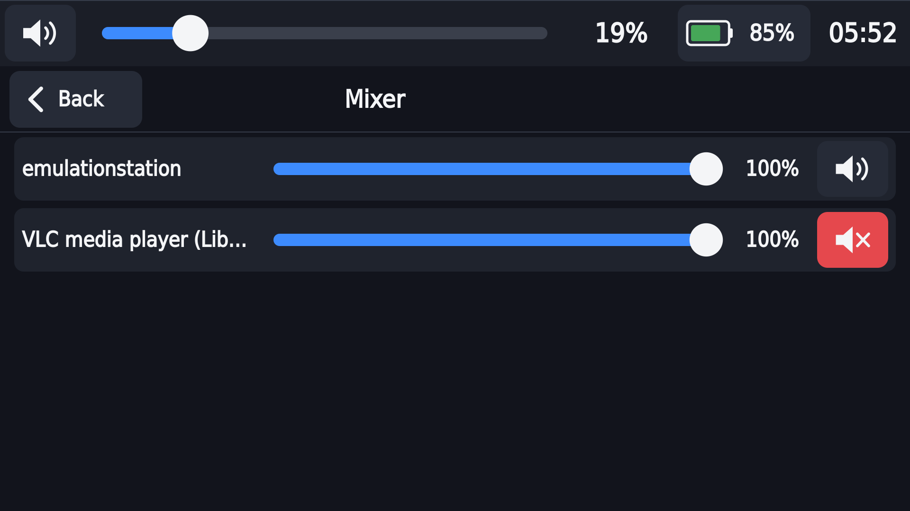

The hardware volume buttons always work, wherever you are. The Command
Center's own volume strip (a slider, mute button and level readout) is
always visible above the tile grid, and a brief on-screen volume readout can
also appear over the Companion view whenever the level changes (this can be
turned off in Audio settings). Dragging the slider changes the sound live;
releasing it "commits" the value, the same way a hardware button press
would, so the two stay in sync.

The **Mixer** tile opens a per-app view: every app currently making sound
(a game, a browser tab, a video) gets its own slider and mute switch, built
from what the audio system reports live. If nothing is making sound, the
list is simply empty rather than showing an error. Mute is not remembered
across a restart — only the volume level is.

Audio settings:

| Setting | Default |
|---|---|
| Show volume overlay | On |
| Volume step | 5% — **stored in the settings file but has no on-screen control yet.** |

### HUD (device info)

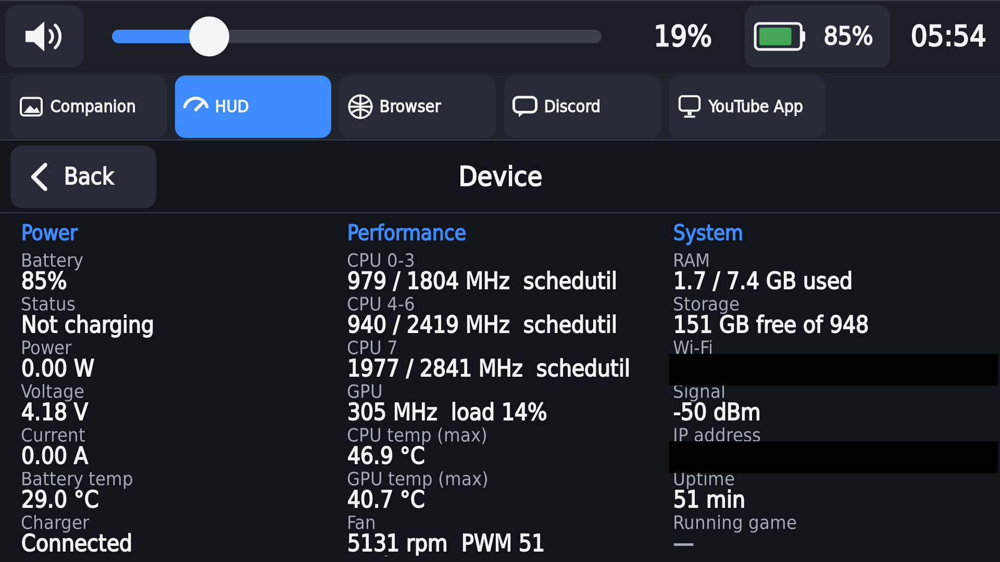

The **HUD** tile opens a full-screen sheet with three columns:

- **Power**: battery percent, charge status, power draw (W), voltage,
  current, battery temperature, whether a charger is connected.
- **Performance**: each CPU cluster's current/maximum speed and governor,
  GPU clock and load, the hottest CPU and GPU temperature readings, fan
  speed.
- **System**: RAM used/total, storage free/total, Wi-Fi network name and
  signal strength, IP address, uptime, and the name of the currently
  running game.

Anything the app can't actually read is shown as an em dash rather than a
misleading zero. A smaller version of this (battery, hottest temperature,
fastest CPU speed, GPU load, free RAM) can also be shown as one of the
"during a game" Companion options, refreshed every few seconds to keep
overhead low.

### Browser

Opens Firefox, on the bottom screen, starting on a search page (chosen
deliberately so the on-screen keyboard appears automatically when you start
typing). While it's open, a strip along the bottom gives you: **Back**,
**Reload**, **Home**, **Keyboard** (shows/hides the on-screen keyboard), and
**Close**. Tapping the page itself gives it keyboard/touch focus, the same
as any other window — the Command Center never takes it away. Closing the
Browser returns its one visible tab to the home page (so reopening the tile
doesn't land you back on whatever you had open before) while leaving your
other open tabs untouched for next time.

### YouTube App

A dedicated tile that opens YouTube's own **TV interface**
(`youtube.com/tv`) in its own, separate browser window — kept apart from the
Browser/Discord window on purpose. **Signing in never asks for a password
on the device**: tap Sign in, and a code/QR square appears; scan it (or
enter the code) on your **own phone or computer**, already signed in to
your Google account. Controls along the bottom: **Home**, a six-button
D-pad (Left/Up/Down/Right/OK/Back), and **Close**. The control strip
hides itself after a few seconds of no touch so video can use the full
screen — tap the thin handle it leaves behind, or swipe up, to bring it
back. **Home** parks the app in the background (still playing) and returns
to the Command Center home screen; **Close** actually ends the session.

Settings:

| Setting | Default |
|---|---|
| Auto-hide TV controls | 4 seconds (0 = never hide) |
| Natural swipe direction | On (content follows your finger, like scrolling a phone). Off sends the swipe's literal direction instead. **This has not yet been checked with a real finger on the actual on-screen interface — treat it as experimental.** |

### Discord

Opens Discord's own web app (`discord.com/app`) in the same browser profile
as the Browser tile. Sign in however Discord's own web login normally
offers (including its own "Log in with QR Code" option, if you'd rather not
type a password on the device) — this is Discord's own page, not something
rp5deck builds. It has been opened, used and closed on the device, including
on a single screen.

### App tabs

The tab strip under the volume strip holds **Companion, HUD, Notes, Browser,
Discord and YouTube App** (and an emulator's second screen while one is open,
and **Steam** while Steam is open).
While a Browser, Discord, or YouTube App window is open (the on-screen strip
is showing just that app's controls), a **Tabs** button lets you jump
straight to another running app — the Companion view, an emulator's second
screen, the HUD, or any of the web apps — without first going back to the
full Command Center. Switching **parks** whatever was showing (it keeps
running/playing in the background) rather than closing it; a small dot on a
tab means that app is running in the background right now.

### Hotkeys

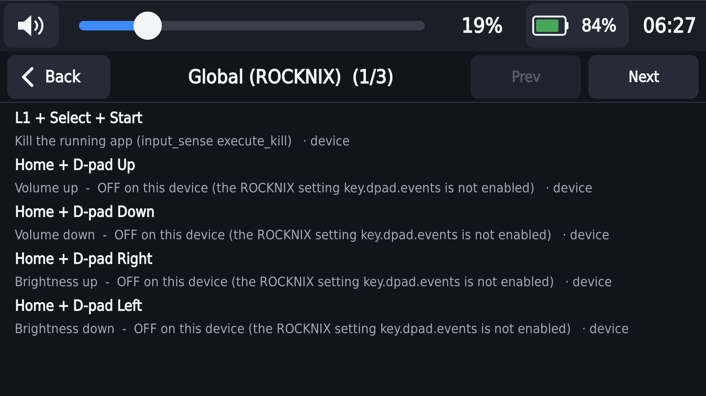

The **Hotkeys** tile shows a paged cheat sheet: a "Global" page for ROCKNIX
itself, then one page per emulator (RetroArch, melonDS, Azahar, DraStic,
Dolphin, and others). While a game is running, that emulator's page is
shown first. The Global and RetroArch pages' button assignments are **read
live from the device's own configuration files**; every other emulator's
page is a fixed reference taken from ROCKNIX's own published defaults, not
read from a file on this device. Either way, each row is labelled either
"device" (physically confirmed on this exact device) or "source" (taken
from ROCKNIX's own published defaults, not independently confirmed) — so
you can tell which is which. If a config file can't be read, the sheet
falls back to its built-in defaults rather than showing an error. A few
combos (for example, exactly which physical button acts as ROCKNIX's "FN"
modifier) are deliberately left off because they could not be confidently
confirmed.

### Stick lights (RGB)

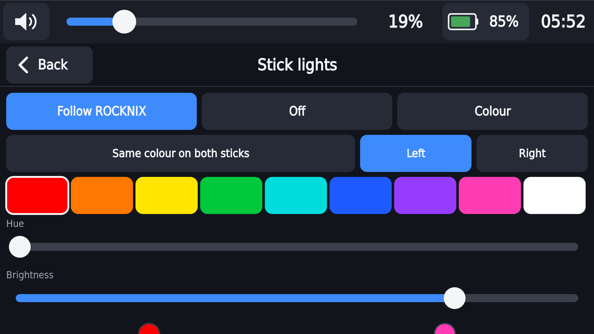

Three modes: **Follow ROCKNIX** (leaves ROCKNIX's own stick-light behaviour
alone), **Off**, and **Colour** (pick your own). "Same colour on both
sticks" links the left and right rings together; turning it off lets you
set them independently. A brightness slider (0–255) applies to both. This
is stored in rp5deck's own settings file, not ROCKNIX's `system.cfg`
(which holds your Wi-Fi password, among other things, and gets rewritten by
EmulationStation). **Known limitation:** ROCKNIX's own background behaviour
(on charging changes, on wake, or the FN+Volume LED shortcut) can still
briefly override your chosen colour; rp5deck checks every 5 seconds and
puts it back, so you may see a brief flicker rather than a permanent
override.

### Clean state

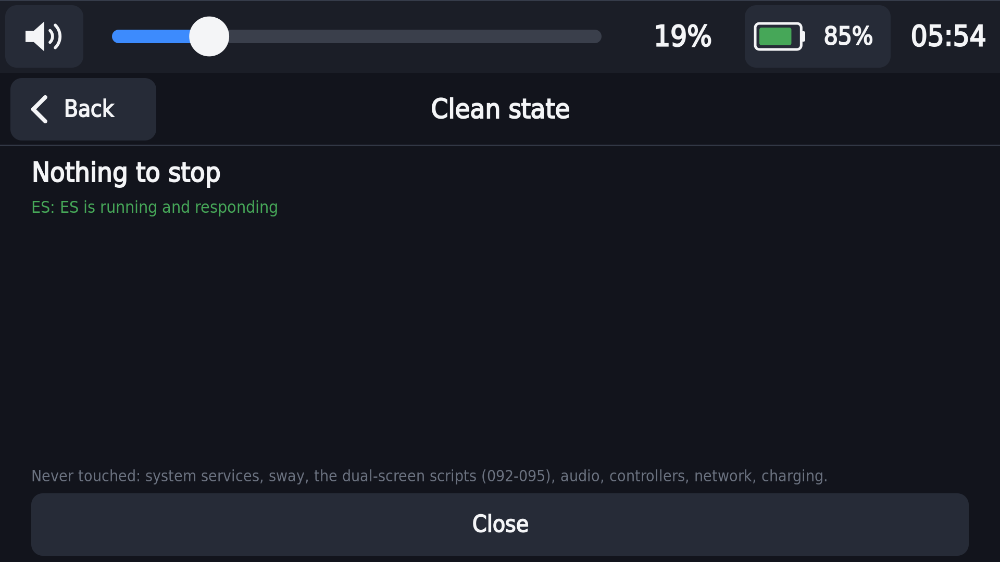

A recovery button for when something's stuck. Tapping it first spends a
moment checking what's actually running, then shows you the **exact list**
of what it's about to stop — before anything happens. What it can close:
the running game/emulator, the Browser/Discord window, the YouTube App, and
the on-screen keyboard — but only things rp5deck itself started. While Steam
is open it also offers, on its own line, to stop the Steam game (Steam stays
open) or to close Steam and go back to EmulationStation; Steam is only ever
asked to quit, never force-killed, and none of this shows when Steam is
closed. It also turns the built-in touchscreen back on if a game left it
disabled. If
EmulationStation itself looks frozen or unresponsive, Clean state can
separately offer to restart just EmulationStation (never the whole window
manager) — with its own extra confirmation when the evidence is
borderline. Nothing runs until you tap the confirm button.

### On-screen keyboard toggle

The **Keyboard** tile is a quick toggle for ROCKNIX's own on-screen
keyboard (the same one the hardware Home+Touch combo brings up), for typing
into an emulator's own settings screens. Tapping it closes the Command
Center so the keys reach whatever's underneath. This is separate from the
Browser tile's own Keyboard button, which shows/hides a second, independent
keyboard instance dedicated to Firefox and appears automatically when you
tap a text field there.

### Sleep

Suspends the device (`systemctl suspend`), after a brief "Sleeping…"
message. A separate background helper (not part of rp5deck, but the Sleep
button relies on it) turns the add-on's screen off just before sleeping and
back on after waking, because suspending with the top screen still lit has
caused device resets on some builds — see
[Known limitations](#12-known-limitations-and-troubleshooting). Use this
button (or the equivalent on the game/EmulationStation screen) rather than
the RP5's own power button where you can.

### Notes

The **Notes** tab is a notebook of pages for the bottom screen:

- **Draw** (the default): draw with your finger. **Pen** cycles white, yellow,
  cyan and red; **Undo** removes the last stroke.
- **Type**: the on-screen keyboard appears; **New line** starts a new line.
- **Clear** empties the page — it needs a second tap within 3 seconds, so one
  stray tap cannot wipe it.
- **Prev / Next / New page** page through the notebook.

Everything is saved as you go to `/storage/rp5deck/notes/notebook.json`.
Verified on the device: finger drawing (5 strokes, 216 points saved).

### Power

The **Power** tile (it replaced the Sleep tile, keeping its place in your
layout) opens **Sleep**, **Restart** and **Shut down**. Restart and Shut down
ask first. **Hibernate** is shown but disabled: it does not resume on this
device yet.

### Over a running game

When the Command Center opens over a game (the dual-screen overlay), it shows
**Mixer, HUD, Hotkeys, Performance, Notes** and **Quit game**, plus **Close**.
Over Steam it also shows **Settings**. Quit game
asks first, then closes the game the same way Clean state does (ES's own quit,
then ROCKNIX's kill for that emulator) — anything since your last save is lost.

### Top screen off

The **Top screen** tile turns the add-on's display off. When the RP5 is the one
powering the add-on it also cuts that power — measured on battery with
EmulationStation idle: **3.0 W → 1.3 W**. (Turning only the display off saved
about 0.3 W, which is why it cuts the power too.) EmulationStation moves to the
RP5's own screen and the Command Center hides with the top screen, so a
confirmation comes first. Turn it back on from **EmulationStation › Ports ›
Top Screen On-Off**, or reboot — a reboot always brings the top screen back.
With a charger plugged into the add-on, only the display goes off (the add-on
is powering itself then).

### Performance

| Mode | What it does |
|---|---|
| **Auto** (default) | The GPU is capped at 587 MHz (or your *GPU overclock* value) for light games; Wii U, PS3, PS2, Vita, Xbox, Switch and GameCube/Wii games — and Steam, Wine or box64 while they use at least one CPU core — lift the cap to 925 MHz and run every CPU cluster at full speed, until 30 s after they stop |
| **Max** | Always boosted |
| **Saver** | Always capped, even for heavy games |

Tap the **Performance** tile to cycle through the modes; its subtitle shows the
current one. This also fixes a ROCKNIX bug where the GPU was never capped at all.

### Brightness

**Settings › Screens** has **Bottom screen brightness** (the RP5's own screen,
a real backlight), **Top screen brightness** and **Match brightness**. The
add-on has no brightness control the RP5 can reach, so the top slider dims it
in software (sway's gamma) — it looks darker but does not save power. Turn on
**Match brightness** once the two screens look alike: after that, moving the
bottom slider moves the top one with it, at the same ratio.

### Screensaver

When EmulationStation's screensaver starts (its own timer and style, set in
ES), the Command Center's screen follows: **dim** dims it, **black / random
video / slideshow** turn it dark. Touch it, or press any button that wakes ES,
and it comes back. A touch that wakes the screen does nothing else.

### YouTube and your controller

The YouTube App and the Browser can no longer read your controller (the Gamepad
API is switched off in both), and tapping YouTube while a game runs gives the
controller straight back to the game.

### Safe charge

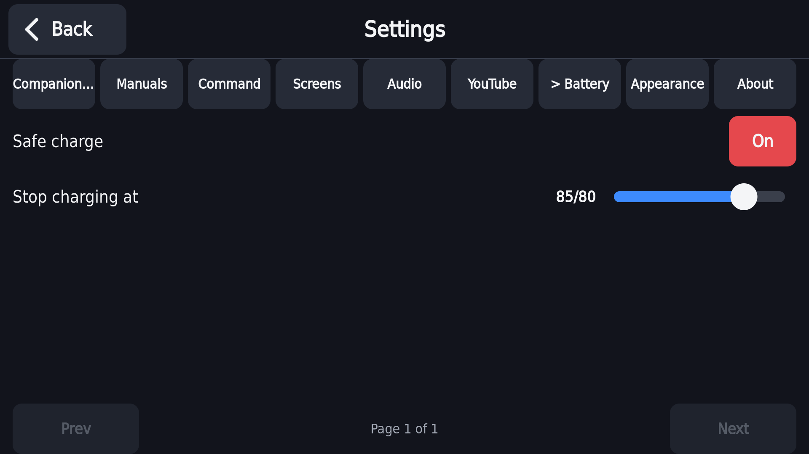

In Settings → Battery: a toggle and a slider (50–95%, in steps of 5;
default 85%) that stop the battery charging once it reaches that level, to
reduce long-term battery wear. Turning the toggle off removes the limit
entirely (charges to 100%). The setting writes to the same file ROCKNIX's
own boot-time charge-limit script reads, so it survives a reboot either way
it's changed. Note: the battery percentage shown elsewhere in the app can
read a little low right at the top of a charge, so "85%" may correspond to
a slightly higher true charge level.

### Screen swap

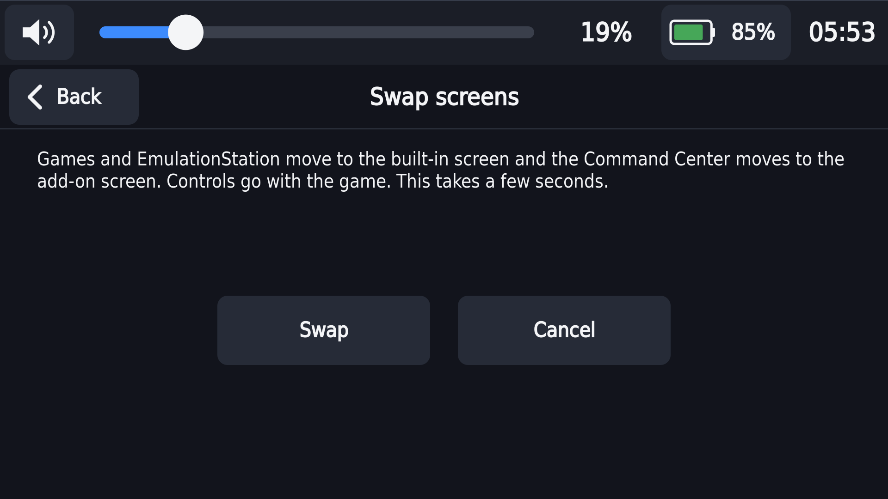

The **Swap screens** tile/setting moves EmulationStation and your running
game to the RP5's own screen, with the Command Center moving to the add-on
screen instead — your controls always stay with wherever the game is. A
confirmation appears first ("this takes a few seconds"); if the add-on
isn't attached, it tells you there's nothing to swap. This is one of the
newest features: swapping back and forth has been confirmed on the device,
but a reboot check in both orientations and a suspend/resume test while
swapped are still outstanding — treat it as experimental until those are
done.

### Appearance (colour themes)

**Settings > Appearance** changes the Command Center's colours. Tap
**Colour theme** to step through the presets; each one applies straight
away, on every screen, with no restart. The small pull tab and mini
Command Center on the game screen pick up the change within about 2
seconds.

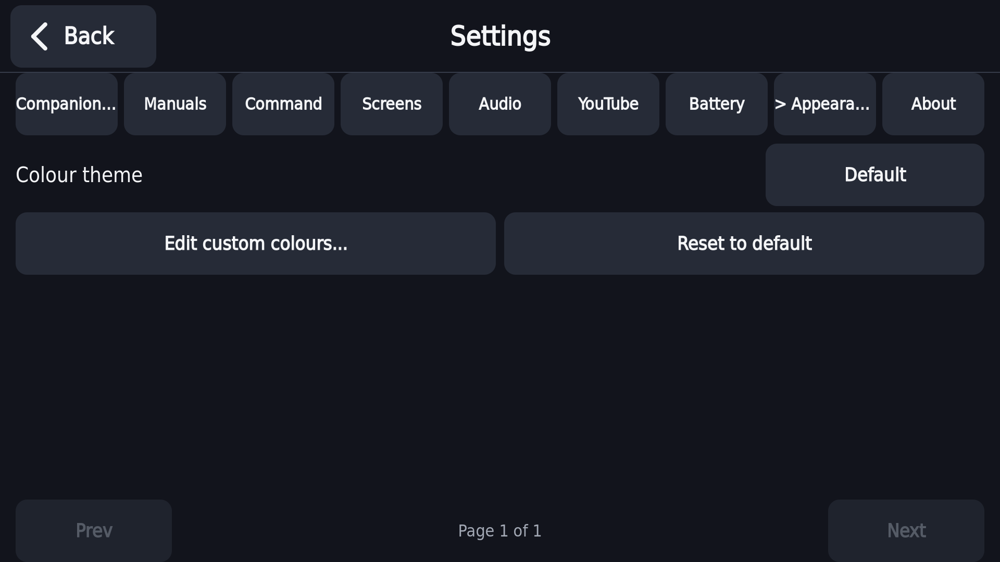

| Group | Presets |
|---|---|
| Built in | Default (the original dark blue look), High contrast |
| RP5 editions | RP5 Black, RP5 White, RP5 16 Bit, RP5 GC, RP5 Yellow, RP5 Turquoise |
| Classic-console inspired | Classic handheld green (Game Boy), 8-bit grey (NES), 16-bit black/red (Genesis), 90s console grey (PlayStation), Charcoal primaries (N64), White/orange swirl (Dreamcast) |
| Your own | Custom |

RP5 16 Bit uses the Super Famicom face-button colours (red, yellow, blue,
green), the same ones as the RP5 button icons. The shell colours of the
other RP5 editions are close approximations of Retroid's product photos,
not official values. Every preset keeps normal text at a contrast of at
least 4.5:1 against its background.

| RP5 16 Bit | RP5 GC |
|---|---|
| 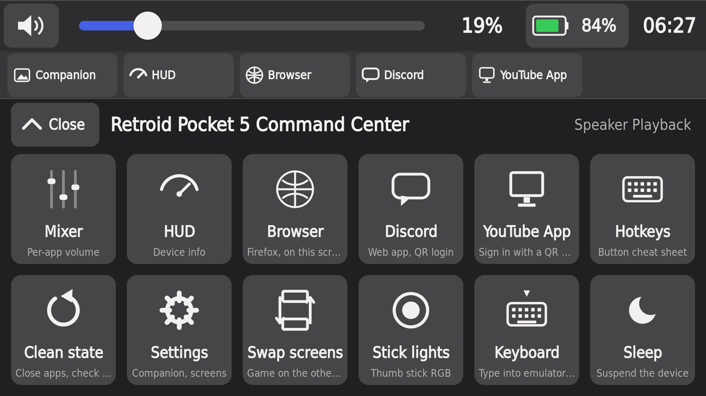 | 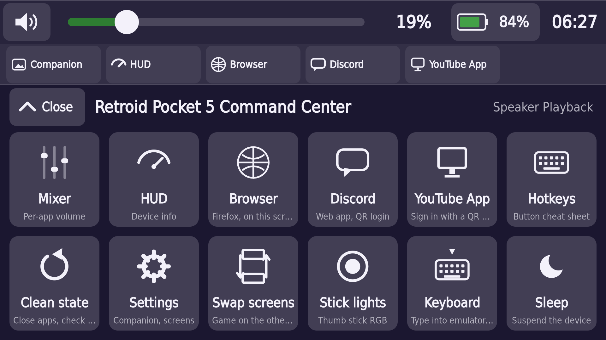 |
| **RP5 White** | **Classic handheld green (Game Boy)** |
| 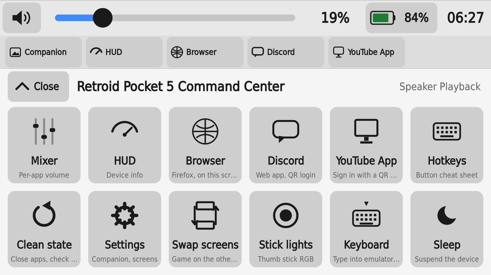 | 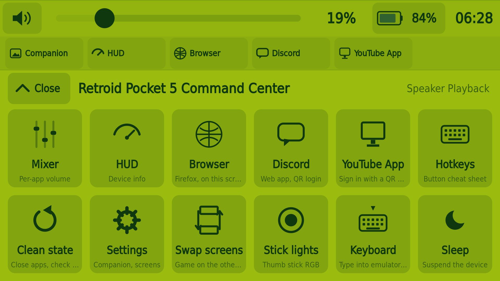 |

**Edit custom colours…** switches to Custom and opens a picker for three
colours: accent, background and text. Each has hue, saturation and
lightness sliders and quick-pick swatches, with a live preview. The other
shades (pressed buttons, lines, dimmed text) are worked out from those
three. If your text is too close in contrast to the background or the
accent colour to read comfortably, a short warning appears; it doesn't stop
you. **Reset to default** puts the original colours back.

The theme is saved in rp5deck's `config.json` like every other setting, so
it survives restarts and updates. An unreadable or unknown value falls back
to Default.

### Button colours

**Settings > Appearance > Button colours** changes the colour of the A, B, X
and Y button pictures EmulationStation shows at the bottom of its screens,
without changing the Command Center's own colours.

- **Match screen theme** (the default) follows your colour theme: an RP5
  edition theme gets that edition's buttons, the PlayStation and Dreamcast
  themes get that pad's colours, anything else the Super Famicom colours the
  icons came with.
- Or pick one: **RP5 16 Bit, RP5 Black, RP5 White, RP5 GC, RP5 Yellow, RP5
  Turquoise, Super Famicom, SNES (US), Xbox, PlayStation, Dreamcast,
  GameCube, Plain grey**.

Colours go by where the button sits, so a controller's colours land where
your thumb expects them (Xbox green is the bottom button, the PlayStation
red circle the right one). Only the RP5 16 Bit colours were sampled from
Retroid's photos; the other RP5 editions are estimates from their names.
EmulationStation shows the change after it restarts. On a device with 2, 3
or 6 face buttons the setting is greyed out ("coming soon").

### Screen size preset

**Settings > Screens > Screen size preset** lays the Command Center out for
a screen of that size and scales it to fit yours. **Auto** (the default)
uses your screen's own size; on the RP5 that changes nothing. On a smaller
screen the whole Command Center is shrunk to fit rather than cut off. Pick a
smaller preset to make everything bigger, a larger one to make it smaller.
Presets: 1920x1080 (RP5, Flip 2), 1280x720 (Powkiddy X55), 1024x768
(RG DS Plus), 720x720 (RG CubeXX), 640x480 (RG353, RG ARC, RG DS).

### Single-screen mode

With one screen - the RP5 without the add-on, or a single-screen device -
EmulationStation and your games have the whole screen. Turn on **Settings >
Command Center > Single-screen mode** (or run **Ports > Command Center
Single Screen On-Off** from EmulationStation) and the Command Center opens
over them:

- tap the small **floating button** in the top-right corner (move it with
  **Corner handle**), or press the **summon button** (Back);
- over EmulationStation you get the whole Command Center; over a running
  game the game set (Mixer, HUD, Hotkeys, Performance, Quit game);
- **Close**, Back again or swiping up puts it away. The game keeps running
  and keeps the controller the whole time.

The **Browser, Discord and YouTube App** work here too. Open one from the
Command Center's tabs and it fills the screen, with a strip of controls at
the bottom (the same strip as with the add-on):

- **Tabs** jumps to another app. A new one opens beside the last, and an app
  you have used before comes back where it was, no restart.
- **Home** (the YouTube App's Home, or Tabs then Companion) goes back to
  what is underneath, EmulationStation or Steam, and keeps the app running.
- **Close** ends the app and lands on what is underneath.
- Only one of them is on screen at a time, and the gamepad never goes to them.
  The strip follows whichever one is showing.

It is off until you turn it on. ROCKNIX's own "Bottom screen content" menu
only offers its Virtual Console, so the Ports entry is the switch on the
EmulationStation side for now.

### Steam

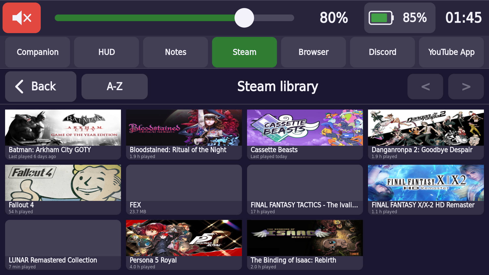

Steam is a game launcher inside ROCKNIX, not a normal emulator, so on its
own it takes the whole screen and stops the desktop the Command Center runs
in. Turn on **nested Steam** once (see
[Installing](#2-installing-updating-removing), step 8) and Steam runs inside
the desktop instead, so the Command Center stays up with everything below.
Steam features only appear while Steam is open.

- **Companion:** the running Steam game's name, art, hours played, last
  played, size, how long you have been playing and update progress. What
  fills the bottom screen during a Steam game is **Settings > Steam >
  During a Steam game, show** (the same choices as for other games, or
  "Same as other games").
- **Steam tab:** your installed games as cover art, last played first. Tap
  one to start it in the open Steam, the Command Center then closes so the
  game shows. The game that is running is marked **Playing**. The button
  at the top left cycles **Recent, A-Z, Most played** for the session. More
  than twelve games make pages, use the arrows at the top right. A game
  with no cached art shows as a name card. If Steam closed meanwhile, the
  tab says so and starts nothing.
- **Clean state:** stop the Steam game (Steam stays open) or close Steam.
- **Over Steam:** the summon button opens the Command Center with Mixer,
  HUD, Hotkeys, Performance, Notes, Settings and Quit game.

Steam's art and playtime come from Steam's own local files, nothing is sent
anywhere, and the gamepad always stays with Steam. Achievements are not in
those files so they are not shown.

### Settings, in full

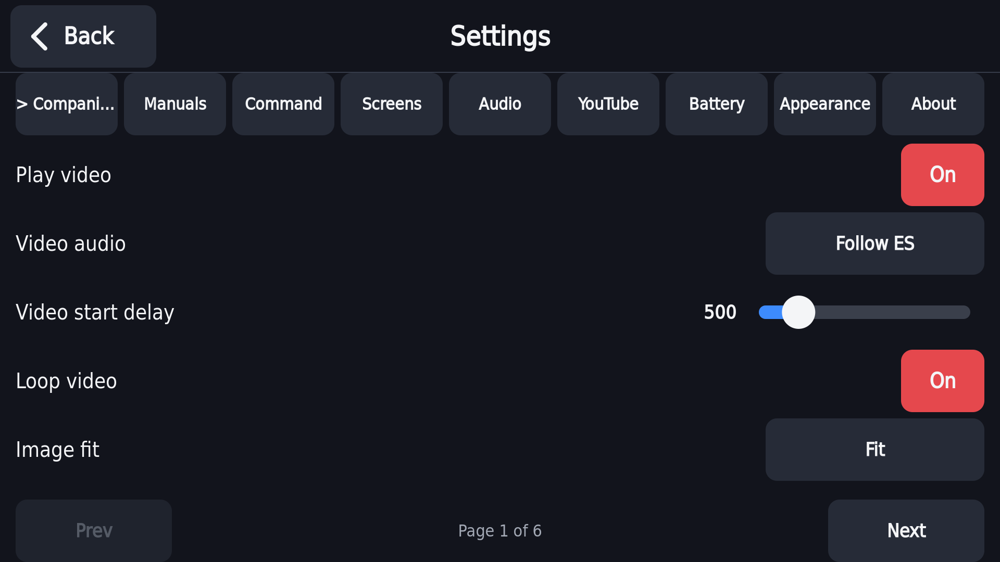

The Settings tile opens a full-screen list with one tab per group:
**Companion**, **Manuals**, **Command** (the Command Center itself),
**Screens**, **Audio**, **YouTube**, **Steam**, **Battery**, **Appearance** and
**About**. Stick lights have their own tile rather than a tab. Every setting
mentioned by name earlier in this guide lives in one of these groups. A few keys exist in rp5deck's
settings file but currently have **no on-screen control** — if you're
comfortable editing `config.json` directly (see
[Where logs and settings live](#13-where-logs-and-settings-live)), stop
rp5deck first:

- `companion.brightness_pct` (bottom-screen brightness, default 80%)
- `manuals.viewer` (manual rendering engine — currently defaults to the
  native, on-device renderer described above)
- `audio.volume_step_pct` (how much each hardware volume button press
  changes the level, default 5%)
- `companion.background_blur` — present in the settings file (default off)
  but does not currently do anything; only the background dim exists as a
  real effect.

## 9. Dual-screen emulators

For systems whose games use two screens (Nintendo 3DS, Nintendo DS, Wii U),
the add-on's screen can show the main/TV screen while the RP5's own screen
shows the game's second screen — including touch, for the systems that use
a touch screen. This is a **per-game (or per-system) setting**, not
something rp5deck turns on globally:

| System | Emulator | Setting | Second-screen window |
|---|---|---|---|
| Nintendo 3DS | Azahar | `3ds.screen_layout=5` (system-wide) or `3ds["<rom filename>"].screen_layout=5` (one game) | "Secondary Window" |
| Wii U | Cemu | `wiiu.gamepad_enabled=true` (system-wide) or `wiiu["<rom filename>"].gamepad_enabled=true` (one game) | "GamePad View" |
| Nintendo DS | melonDS (the default DS core) | `nds["<rom filename>"].screen_layout=6` (per game) | titled with a `[w2]` prefix |
| Nintendo DS | DraStic/dsperate (alternate core) | Not available as a per-game setting yet — experimental/future work. | — |

These are ROCKNIX `system.cfg` keys — the same file EmulationStation writes
when you change per-game or per-system settings from its own menus. If
you'd rather edit the file directly, **stop EmulationStation first**
(`systemctl stop essway`) — it holds its own copy in memory and rewrites the
whole file whenever it saves, which can undo an edit made while it's
running — then restart it (`systemctl restart essway`) afterwards.

Once the setting is in place, the game's second window is automatically
moved to the RP5's own screen (by the `dual-screen-layout-and-power` daemon, not
rp5deck itself), and the Command Center gets out of the way (see
[Command Center over a game screen](#10-command-center-over-a-game-or-emulator-screen)
below) so the game's own touch screen isn't covered.

**Dual-screen settings missing:** ROCKNIX checks `system.cfg` at every boot,
and if the file looks damaged (typically after a crash or an unclean
shutdown) it quietly puts back its last backup. That backup is only
refreshed at a clean shutdown, so settings added since then can disappear.
The Command Center checks for the keys above when it starts and every five
minutes after, and shows a banner on Home naming any that are missing:

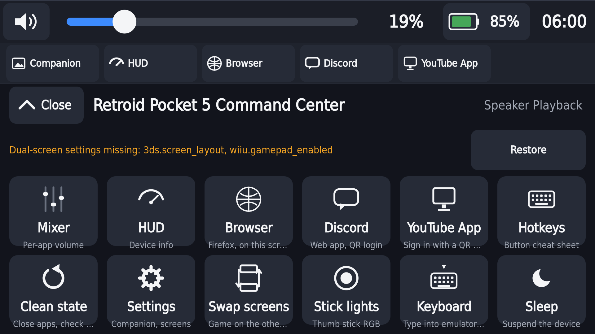

Tap **Restore**, then confirm. The Command Center refuses while a game is
running. Otherwise it stops EmulationStation for a few seconds, backs up
`system.cfg` to `/storage/rp5deck-backups/`, adds back only the missing
keys (nothing else in the file is touched), refreshes ROCKNIX's own backup
so the next boot keeps them, and starts EmulationStation again.

## 10. Command Center over a game or emulator screen

- **Over an emulator's second screen** (a running DS/3DS/Wii U game whose
  second screen is on the RP5's own panel): press the summon button (Back)
  to pop a small Command Center over it, with **Mixer**, **HUD**,
  **Hotkeys**, **Performance**, **Quit game** and a big **Close** — enough
  to check volume, change the speed profile or quit without leaving the
  game. An optional small tap-target ("corner handle", off by default)
  can be enabled as an alternative to the button, in one of the screen's
  corners.
- **Over the game/EmulationStation screen**: a small pull tab in the corner
  (on by default; can be turned off in Command Center settings — "Pull tab
  on game screen") opens a similar mini Command Center — Mixer, HUD, and
  Swap screens — directly over whatever's on that screen.

Both are deliberately limited to a few tiles: the emulator's own window
still needs the touch input for the game underneath.

## 11. Charging with the add-on

- **Safe charge** (see [above](#safe-charge)) works as described and has
  been verified against the device's own charge-limiting mechanism.
- **Known limitation:** after the RP5 has been powering the add-on, a
  charger plugged into the add-on can agree on a charging voltage but never
  actually start charging, so the battery keeps draining. This is a
  charger-driver issue in the kernel that is still being worked on, not
  something rp5deck controls.
- The Command Center watches for this. When a charger is connected, the
  battery is still draining, and the charger has reported no input current
  for a while (this can be flagged in as little as 20 seconds, not always a
  full minute), Home shows:

  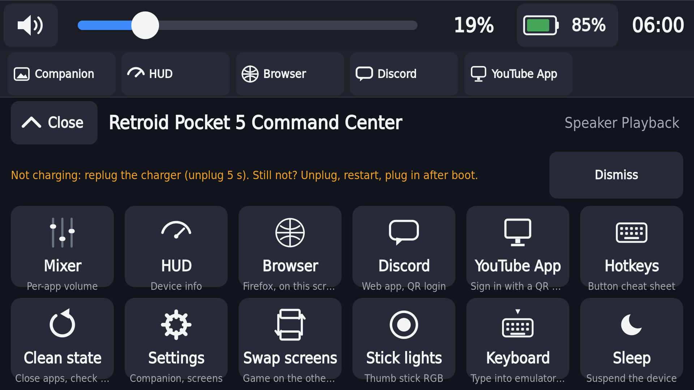

  The order things are plugged in matters. The stuck state comes from the
  add-on going onto the RP5 before its charger, so that for a moment the RP5
  powers the add-on. To recover:
  1. Unplug the add-on from the RP5.
  2. Connect the charger to the add-on first.
  3. Plug the add-on back into the RP5.

  If it still isn't charging a minute later, unplug everything, restart the
  RP5 on battery, and plug in the same way (charger into the add-on first)
  once EmulationStation is back. Restarting with the charger still plugged in
  is not recommended: in testing it came back up stuck.

  **Dismiss** hides the banner until the next time you unplug the charger. It
  never shows while the RP5 is powering the add-on on its own, which is
  normal and drains the battery by design.
- **Sleep is paused while the charger is stuck.** A suspend in that state
  reset the RP5 in testing, so a small background guard
  (`no-sleep-while-charger-stuck`) blocks sleep until charging works again. It
  blocks the power key, the lid, and any other suspend request. While it's
  active the power button doesn't put the RP5 to sleep. This works with or
  without the top screen attached. The kill switch is
  `/storage/.disable-charge-sleep-guard`.
- Also see [Top screen not turning on with a charger connected](#12-known-limitations-and-troubleshooting)
  below, which is a related but separate issue.

## 12. Known limitations and troubleshooting

| Symptom | Status | What to do |
|---|---|---|
| The add-on's screen stays dark after rebooting with a charger plugged in | Still being worked on; at such a boot the port never agrees a power contract with the charger, so the add-on's display link never starts. | Unplug the charger: the RP5 then powers the add-on itself and the screen comes back within a few seconds. Plug the charger in again once it is on. |
| A charger plugged into the add-on doesn't charge the device | See [Charging with the add-on](#11-charging-with-the-add-on) above; the Command Center shows a banner when it happens. | Unplug the add-on, connect the charger to it first, then plug the add-on back in. If that doesn't help, unplug everything, restart on battery, and plug in the same way after boot. Sleep is paused until it charges. |
| Dual-screen settings (3DS/DS/Wii U layout keys) disappear after a crash or an unclean shutdown | A background check and a Restore banner exist for this — see [Dual-screen emulators](#9-dual-screen-emulators). | Use the Restore button when the banner appears. |
| A 3DS game used to freeze on launch until its window was moved by hand | **Fixed automatically.** A rule in the `dual-screen-layout-and-power` daemon now places the game's window correctly every time. | Nothing — this should no longer happen. |
| The device resets instead of suspending, or doesn't wake properly, while the add-on's screen is on | A background helper now turns the add-on's screen off before suspending and waits for it to properly reconnect before turning it back on, specifically to prevent this. Use the Sleep button (or the equivalent on the game screen) rather than the power button where possible. | If the top screen doesn't come back within about 20 seconds of waking, check the add-on's connection; a reboot is a fallback if it stays dark. |
| A game or emulator is completely stuck | — | Hold **L1 + Select + Start** together — this is ROCKNIX's own kill combo, not a rp5deck feature, and works regardless of what's frozen. |
| Steam takes over the screen and the Command Center goes away while it runs | That is ROCKNIX's own Steam launch, which stops the desktop. Nested Steam, installed with `install-steam-nested.sh`, avoids it and is what the Steam features need. | Install nested Steam (step 8 under Installing). Remove it the same way if you'd rather have ROCKNIX's launch. |
| Steam tab pages | Paging past twelve games is covered by tests but has not been tried on the device, which has eleven games. | Should work, treat it as lightly tested. |
| Steam achievements | Not in Steam's local files, so they are not shown. | — |
| Real-finger touch dragging on sliders | The main volume slider has been dragged with a real finger on the device and behaves correctly (commits once, on release). Other sliders (per-app volume, Appearance's colour pickers, stick-light brightness) have mostly been checked with synthetic/injected touches during development, not yet a real finger. | Should work throughout, but treat the less-tested sliders as lightly tested. |

## 13. Where logs and settings live

- **Settings**: `/storage/rp5deck/config.json`. If this file is missing,
  unreadable, or has an invalid value in it, rp5deck falls back to defaults
  for whatever's wrong rather than failing to start — to get a completely
  fresh settings file, stop rp5deck, delete this file, and restart it.
- **App logs**: `/storage/rp5deck/log/command-center-app.log` (the supervisor that
  starts/restarts everything), `/storage/rp5deck/log/rp5deck.log` (the app
  itself), and `/storage/rp5deck/log/rp5deck-overlay.log` (the small
  Command Center that can appear over the game/EmulationStation screen).
- **Dual-screen layout daemon's log**:
  `/storage/.config/autostart/dual-screen-layout-and-power.log`.
- **Install backups**: `/storage/rp5deck-backups/<date-and-time>/`.

## 14. Uninstall

See [Removing](#removing) under Installing, above — the short version:
roll back the app with the install script, remove the EmulationStation
hooks and restart EmulationStation, and use the `/storage/.disable-*` kill
switches for anything you'd rather pause without fully removing it.

## 15. Coming soon

Not in this version, in rough order of how close they are:

- **TV mode:** the Command Center on a TV with a gamepad, keyboard or mouse for control, and a mouse mode for
  the web apps. Designed, not built.
- **Hibernate:** the Power sheet shows it greyed out as "Work in progress". Suspend is the low-power mode
  for now.
- **A packaged installer:** installing is still copying files and running a few scripts (section 2). One
  script that does all of it, Steam step included, is planned.
- **Steam on the device:** paging through a big library, tried on a bigger library than ours.
- **Upstream ROCKNIX fixes** the Command Center depends on or ships alongside (the charger follow-ups and a USB
  suspend crash fix) are going to ROCKNIX as pull requests after its code freeze. Until they are merged
  you need the project's kernel for the charging behaviour in section 11.

## 16. Credits / licence

The Command Center, its scripts and this guide are licensed under the GNU
General Public License v2.0 (see `LICENSE` in the repository), the licence
ROCKNIX uses for contributions. They were written with AI assistance and
tested on a Retroid Pocket 5 with the Dual Screen add-on.
